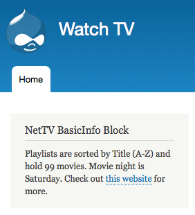

#Drupal 8 Services, Dependency Injection, and decoupling your code

*Disclaimer: This is not a tutorial about the services module, rather the object-oriented PHP concept of Services, the Service Container and Dependency Injection.*

##Intro

As a dyed-in-the-wool Drupal programmer looking to get into coding Drupal 8, there were a few modern subjects I had to familiarize myself with. Chief among them was the concept in Symfony and Drupal 8 called _Services_, which help you keep your code decoupled and, in my opinion, easier to read.

A _Service_ is simply an object, and you usually only have one instance of each service's class for each service on a site. For example, Drupal 8 sites have a service for sending [email](https://api.drupal.org/api/drupal/core!lib!Drupal!Core!Mail!MailManager.php/function/MailManager%3A%3Amail/8), for [logging errors](https://api.drupal.org/api/drupal/core!lib!Drupal!Core!EventSubscriber!ExceptionLoggingSubscriber.php/class/ExceptionLoggingSubscriber/8), for [making HTTP requests](https://api.drupal.org/api/drupal/core!lib!Drupal!Core!Http!Client.php/class/Client/8), and dozens of other common tasks.

While Services are objects, not all objects are suitable services - for example, a node is not a service, it is content. Nor is a View a service. There is, however, a [`token`](https://api.drupal.org/api/drupal/core!lib!Drupal!Core!Utility!Token.php/class/Token/8) service, which is a great example, since you only really need one token service for your entire site. The new Configuration Management systems in Drupal 8 use services extensively, and you will learn a bit about Config in this blog post. First, I'll show you how a very common function, making links, uses services.

##A Quick Example of Services

Services are used in a number of ways in Drupal. Many of the core systems are implemented as services, and many familiar core functions are now procedural wrappers for services.

For example, the `l()` function is now a wrapper for the [`LinkGenerator::generate()`](https://api.drupal.org/api/drupal/core!lib!Drupal!Core!Utility!LinkGenerator.php/function/LinkGenerator%3A%3Agenerate/8) function. You call the function as such `\Drupal::l()`, because everything is namespaced now, but that's another blog post.

The source code of `l()` is:

```
public static function l($text, Url $url, $collect_cacheability_metadata = FALSE) {  
  return static::getContainer()->get('link_generator')->generate($text, $url, $collect_cacheability_metadata);  
}  
```

This says to get the service called `link_generator` and call its `generate()` method. This way, you don't have to know where the link_generator class is defined, or even what class name it uses, but you can always find it if you need to.

##A metaphor for Services

One way of thinking about Services, if this is a new concept for you, is the set-top-box on your TV. Whether it's made by Apple, Amazon, Google or Roku, these set-top boxes all have Services in common. I don't need to know the IP address and the API schema for Netflix in order to watch a film. If I'd rather watch HBO Go, I can ask my set-top-box to load that service instead. The set-top-box is a _Service Container_ that gives you a means of accessing any of these services, obscuring the technical details. Drupal also uses the idea of a service container to abstract the loading and instantiation of service objects. The above code called the `static::getContainer()` method, returning the service container, which was then used to load `link_gernerator`.

##A Practical Example of Services and the Service Container in Drupal 8

For the following example, let's assume we are creating a NetTV module for a Drupal 8 site that will give us some of the features we expect out of an internet TV service. In Drupal 8, you can put your custom modules in the `/modules` directory in the document root of your Drupal site. All your files for the following example will live in the `/modules/custom/nettv` directory.

Each Drupal 8 site comes with close to 300 Services that are defined by core. One example we might use in our set-top-box metaphor is the Config service or [Simple Configuration API](https://www.drupal.org/node/1809490). The config service is referenced by the `/core/core.services.yml` file, like so:

```
  config.factory:  
    class: Drupal\Core\Config\ConfigFactory  
    tags:  
      - { name: event_subscriber }  
      - { name: service_collector, tag: 'config.factory.override', call: addOverride }  
    arguments: ['@config.storage', '@event_dispatcher', '@config.typed']  
```

The ConfigFactory service is a class that can load Config information out of your Drupal site (Config has replaced `variable_get()` and `variable_set()` in Drupal 8). The code above simply maps an alias that can be invoked in a `modulename.services.yml` file with the string `@config.factory`. The `@` symbol in this case tells Drupal's Service Container to find the ConfigFactory class, and how it should be instantiated with the `arguments` line. The `@config.storage` is another service that knows where to store variables on your site - usually in YAML files. `@config.typed` helps to store different data types in config objects, and the `@event_dispatcher` helps to "lazy load" classes so loading code and instantiating objects only happens when the objects are actually needed, which reduces the overhead of your application and keeps the site fast and lean.

Part of the NetTv module will be a `nettv.services.yml` file that lives in your `nettv` module directory:

```
services:  
  nettv.watch_shows:  
    class: Drupal\nettv\WatchCartoons  
    arguments: ["@config.factory"]  
```

There are lots of things to point out about this file:

* There is a reference to a class called `WatchCartoons`, which is defined as a service provided by this module.
* Just as with the defenition of `config.factory` in core, we are naming a Service called `nettv.watch_shows`.
* The name of the service is anything you want. It does not depend on the class name, which keeps services flexible.
* The `WatchCartoons` class you write does not need to be specific to this module or even Drupal in order to be used, because eventually the Service Container will call it by using this YAML definition. i.e. You can bring in outside libraries from github or other projects.
* By using this Service model and namespacing, your could have another module on the site that defines a `WatchCartoons` class and never fear a conflict between the two.
* When you add the ConfigFactory to your class' constructor, it will be added using Dependency Injection. You can rest easy knowing that Drupal's Service Container will take care of loading the right code and getting the right object to the constructor at the right time.

##The Code

Before you go any farther, I'm going to save you several steps by having you [clone this github repository](https://github.com/liberatr/nettv), which contains a copy of the code for this tutorial. Go and get a copy of this module and open it in your favorite editor, then come back and keep reading.

##Constructing an object that depends on a Service

In `WatchCartoons.php`, look at the constructor for the class:

```
class WatchCartoons {  
...  
  public function __construct(ConfigFactory $config_factory) {  
    $this->config_factory = $config_factory;  
  }  
...  
}  
```

Notice that `WatchCartoons` is just a basic PHP class, it does not extend or implement anything specific to Drupal. In this case we are using `ConfigFactory`, but any code that uses this object does not know that, the implementation is kept inside our methods.

As soon as you create a new WatchCartoons object, it expects there to be an instance of `ConfigFactory` passed in so its methods can use it to retrieve and store config data. The argument to the constructor is type-hinted, so it must be a `ConfigFactory` object - we made sure this would work in our `nettv.services.yml` above.

When you write code that expects an instance of the `ConfigFactory`, you're using _Dependency Injection_ - you don't instantiate the `$config_factory`, your system provides it, specifically the Service Container. You'll sometimes see a Service Container referred to as a Dependency Injection Container.

##Using the Config Factory as a Service

Finally, look at the next method on the `WatchCartoons` class:

```
class WatchCartoons {  
...  
  public function getBasicInformation() {  
    $config = $this->config_factory->get('nettv.basic_information');  
  
    return sprintf(  
      'Playlists are sorted by %s and hold %d movies. Movie night is %s. Check out %s for more.',  
      $config->get('playlist.sort'),  
      $config->get('playlist.maxlength'),  
      $config->get('movienight'),  
      \Drupal::l('this website', Url::fromUri($config->get('url')))  
    );  
  }  
...  
}  
```

The config itself is loaded from a YAML file inside your  project `config/install/nettv.basic_information.yml` - until Drupal saves it. You can set the default values for your NetTV module like so:

```
movienight: Saturday  
playlist:  
  sort: 'Title (A-Z)'  
  maxlength: 99  
url: 'http://example.com'  
```

The code in the `getBasicInformation()` method will load the values from Config and use them to print out the message with the configurable variables you define. Right now there is no way to change this config once it is loaded. That's another tutorial.

Bonus: there is also an instance of `\Drupal::l()` from before, just so you can see it in practice.

##Using your Class in Drupal

This wouldn't be a complete tutorial unless you could view the information about your NetTV service somewhere on your Drupal site, so we'll make a block. In your project you'll need a file at `src/Plugin/Block/NetTVBlock.php` with this code:

```
class NetTVBlock extends BlockBase implements ContainerFactoryPluginInterface {  
...  
  public function __construct(array $configuration, $plugin_id, $plugin_definition, $basic_info) {  
    parent::__construct($configuration, $plugin_id, $plugin_definition);  
    $this->basic_info = $basic_info;  
  }  
...  
  public function build() {  
    $build = [];  
    $build['nettv_basicinfo_block']['#markup'] = $this->basic_info;  
  
    return $build;  
  }  
...  
  public static function create(ContainerInterface $container, array $configuration, $plugin_id, $plugin_definition) {  
    return new static(  
      $configuration,  
      $plugin_id,  
      $plugin_definition,  
      $container->get('nettv.watch_shows')->getBasicInformation()  
    );  
  }  
}  
```

This code provides a Block you can enable through Drupal's admin interface. I assume you know how to place a block on a Drupal site, even in Drupal 8. Once you do, you will see the output from the `getBasicInformation()` method in the body of the block, like this:



Notice that while there are lots of OOP-isms in this project, we never really had to use the `new` keyword. We are not in the weeds instantiating objects, just snapping together Services, Config and finishing everything off in the Drupal UI. Once you learn how to work with Services and Dependency Injection, you'll be thinking at a higher level, and you can just focus on the specific task you're working on. This is one of the promises of Drupal, to solve 80% of the problems for you, and let you focus on the 20% of your project that is unique.

##Using Service Container for a Block

In our Block definition, we used the `create()` method, which is part of the `ContainerFactoryPluginInterface`. This allows us to take advantage of the power of the Service Container when loading our block, and it keeps implementation-specific details out of the `build()` method of the block. If we wanted to switch out the `WatchCartoons` class with another one, we would simply need to make sure any new class also had a `getBasicInformation()` method and change the `nettv.services.yml` in our module. If the new class had a different means of getting this information, we still wouldn't have to touch the `build()` method, as long as we passed in a string. At the end of the day, this is just an example. Your mileage will vary.

The new concept of using a Service Container to instantiate objects should be a bit clearer to you now. Remember that it exists to give you a standard way to work with objects (Services) you need to include in your project, and that using it the right way will save you time and headaches while making it easier for non-Drupal programmers to read an understand your code. While this can feel like more work to a Drupal veteran, remember that procedural Drupal 7 code looks pretty dense to other coders. This way employs less "magic naming"; instead it says what it does and how the system should go about loading and running everything.

##Further Reading

* [Example NetTv Module for this tutorial on GitHub](https://github.com/liberatr/nettv)
* [Video from DrupalCon Barcelona describing Services and Dependency Injection](https://youtu.be/QFsQAWHqs2U?t=26m39s)
* [Drupal.org: Services and dependency injection in Drupal 8](https://www.drupal.org/node/2133171)
* [Drupal.org: Structure of a Service File](https://www.drupal.org/node/2194463)
* [Drupal.org: Configuration Storage in Drupal 8](https://www.drupal.org/node/2120571)
* [Drupal.org: Simple Configuration API](https://www.drupal.org/node/1809490)
* [Slideshow: Building Modules for Drupal 8](http://brantwynn.github.io/d8slides)
* [Tutorial: Programmatically creating a block in Drupal 8](mattkorostoff.com/article/programmatically-creating-a-block-in-drupal-8)
* [Tutorial: Config and the Service Container](http://www.sitepoint.com/building-drupal-8-module-configuration-management-service-container/)
* [Drupal.org: Examples for Developers](https://www.drupal.org/project/examples)
* API.Drupal.org: [BlockBase.php](https://api.drupal.org/api/drupal/core!lib!Drupal!Core!Block!BlockBase.php/class/BlockBase/8) and [ContainerFactoryPluginInterface.php](https://api.drupal.org/api/drupal/core!lib!Drupal!Core!Plugin!ContainerFactoryPluginInterface.php/8)

##Generating this code with Drupal Console

To get started, I generated this module with the [Drupal Console](http://drupalconsole.com/), then edited it. I highly recommend it for those new to OOP and Drupal 8, and lazy programmers.

Here are the commands I used:

```
drupal generate:module --module=NetTv --machine-name=nettv --module-path=/modules/custom/ --description='NetTV Services Example'  --core=8.x  --package=demo  --dependencies='block'  --no-interaction
cd modules/custom/nettv
drupal generate:plugin:block --module="nettv"  --class-name="NetTVBlock"  --label="NetTV BasicInfo Block"  --plugin-id="nettv_basicinfo_block"  --no-interaction
drupal generate:service  --module="nettv"  --service-name="nettv.watch_shows"  --class-name="WatchCartoons"  --interface="no"  --services="config.factory"  --no-interaction
```
